# Real-Time Push Architecture: Admin Portal

> **Goal**: Implement webhook-based real-time updates for Admin UI using pure Cloudflare infrastructure  
> **Pattern**: WebSocket + Webhooks (No Polling)  
> **Stack**: Cloudflare Workers, Durable Objects, KV, D1

---

## Architecture Overview

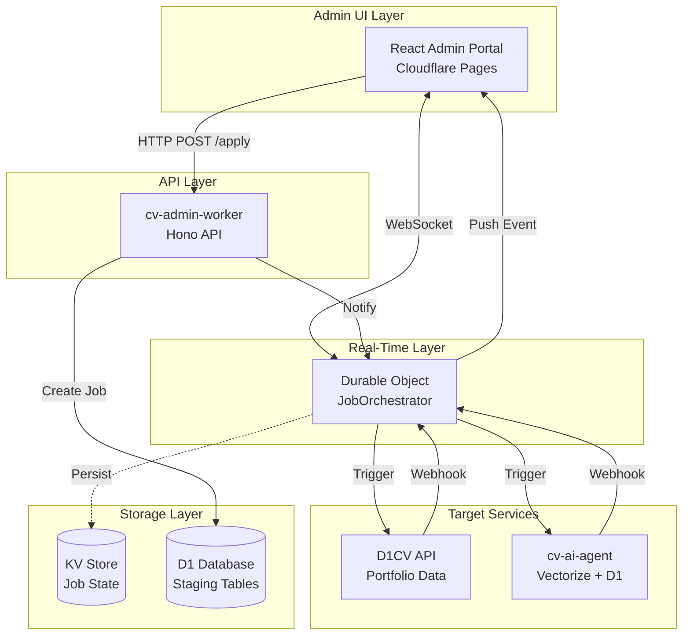

---

## Communication Layers

### Layer 1: UI ↔ Durable Object (WebSocket)

**Purpose**: Persistent bidirectional connection for real-time updates

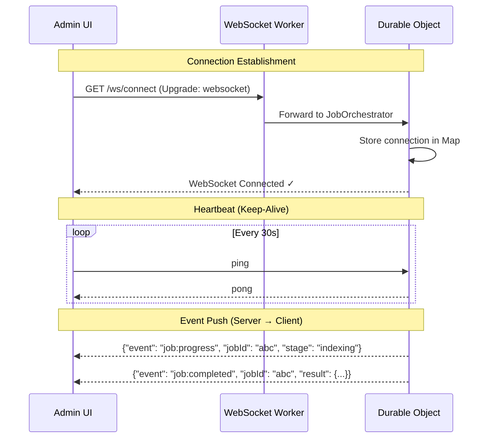

**Key Points**:
- WebSocket established on page load
- Connection maintained throughout session
- DO can push events **anytime** without client request
- Automatic reconnection on disconnect

---

### Layer 2: UI → API (HTTP Request/Response)

**Purpose**: Submit jobs, fetch data, perform CRUD operations

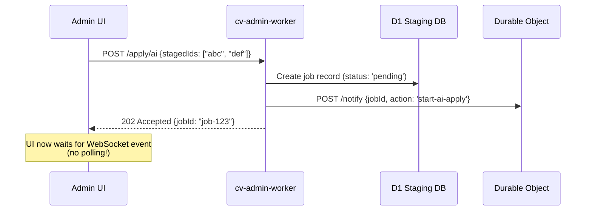

**Key Points**:
- Standard REST API for mutations
- Returns immediately with job ID (202 Accepted)
- Does NOT wait for completion
- Notifies DO to start orchestration

---

### Layer 3: Durable Object → Target Services (HTTP Trigger)

**Purpose**: Orchestrate long-running operations across services

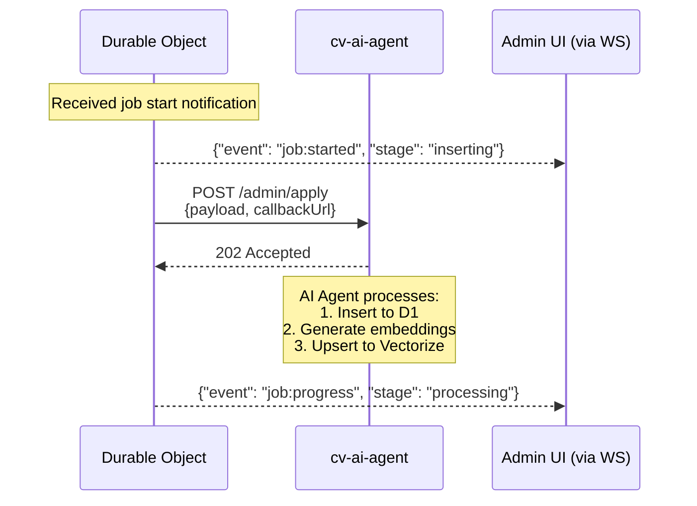

**Key Points**:
- DO initiates work by calling target APIs
- Passes `callbackUrl` for webhook response
- Target services return 202 immediately
- DO pushes progress to UI via WebSocket

---

### Layer 4: Target Services → Durable Object (Webhook Callback)

**Purpose**: Notify completion of async operations

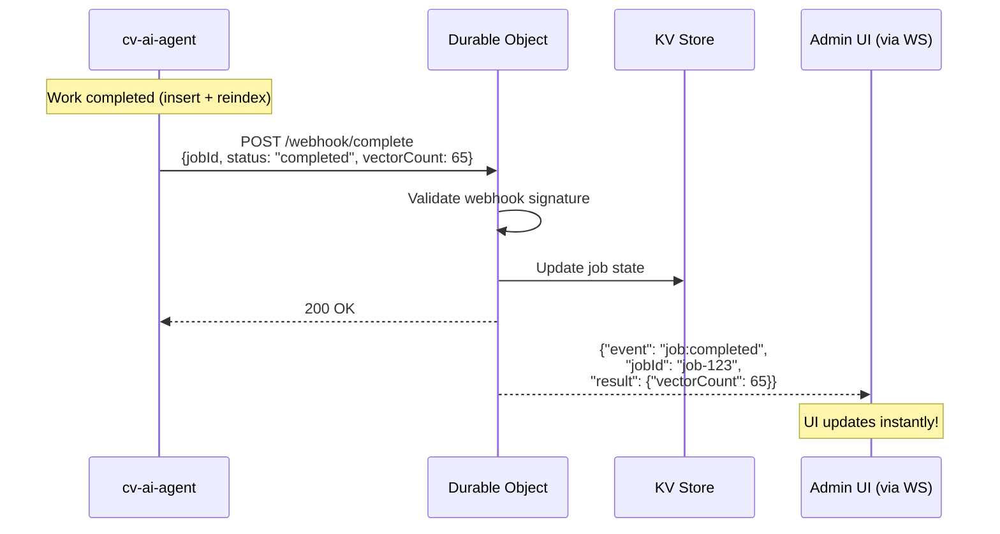

**Key Points**:
- Target service calls webhook when done
- Webhook includes job ID and result
- HMAC signature for security
- DO immediately pushes to all connected clients

---

## Complete Flow: Apply to AI Agent

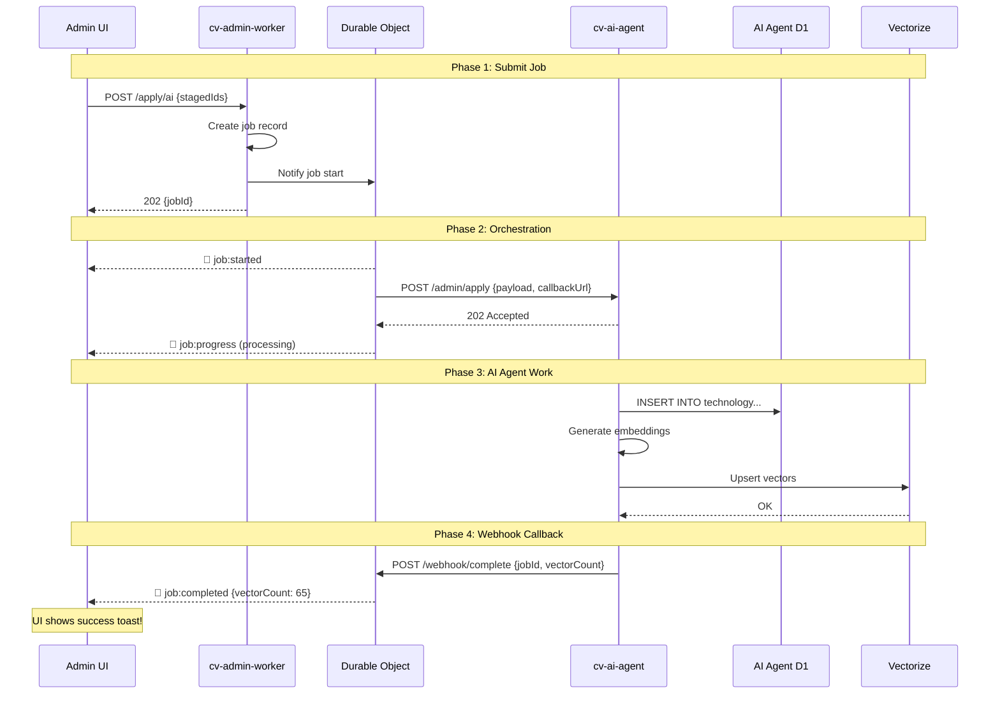

---

## Durable Object Design

### Responsibilities

| Responsibility | Description |
|----------------|-------------|
| **WebSocket Hub** | Maintain connections to all Admin UI clients |
| **Job Router** | Receive job notifications, trigger appropriate service |
| **Webhook Receiver** | Accept callbacks from target services |
| **Event Broadcaster** | Push events to connected clients |
| **State Manager** | Track job status in KV |

### State Structure

```typescript
interface JobOrchestratorState {
  // Connected WebSocket clients
  clients: Map<string, WebSocket>;
  
  // Active jobs being tracked
  activeJobs: Map<string, {
    jobId: string;
    target: 'd1cv' | 'ai-agent';
    status: 'pending' | 'processing' | 'completed' | 'failed';
    startedAt: number;
    payload: any;
  }>;
}
```

### HTTP Endpoints (on Durable Object)

| Endpoint | Method | Purpose |
|----------|--------|---------|
| `/ws/connect` | GET (Upgrade) | WebSocket connection from Admin UI |
| `/notify` | POST | Receive job start notification from cv-admin-worker |
| `/webhook/d1cv-complete` | POST | Callback from D1CV API |
| `/webhook/ai-complete` | POST | Callback from AI Agent |
| `/status/:jobId` | GET | Check job status (fallback) |

---

## WebSocket Message Protocol

### Client → Server (Admin UI → DO)

```typescript
// Subscribe to job updates
{ "type": "subscribe", "jobId": "job-123" }

// Heartbeat
{ "type": "ping" }

// Unsubscribe
{ "type": "unsubscribe", "jobId": "job-123" }
```

### Server → Client (DO → Admin UI)

```typescript
// Connection confirmed
{ "event": "connected", "clientId": "client-abc" }

// Job lifecycle events
{ "event": "job:started", "jobId": "job-123", "target": "ai-agent" }
{ "event": "job:progress", "jobId": "job-123", "stage": "indexing", "percent": 50 }
{ "event": "job:completed", "jobId": "job-123", "result": { "vectorCount": 65 } }
{ "event": "job:failed", "jobId": "job-123", "error": "Vectorize timeout" }

// Heartbeat response
{ "event": "pong" }
```

---

## Security Considerations

### WebSocket Authentication

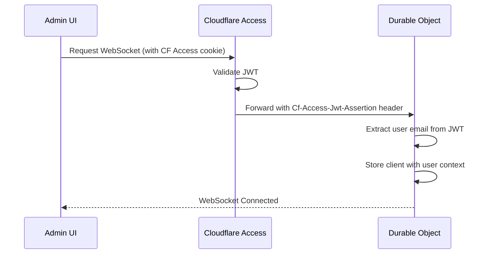

### Webhook Validation

```typescript
// AI Agent signs webhook
const signature = crypto.createHmac('sha256', WEBHOOK_SECRET)
  .update(JSON.stringify(payload))
  .digest('hex');

// POST to DO with signature header
headers: { 'X-Webhook-Signature': signature }

// DO validates
const expected = crypto.createHmac('sha256', WEBHOOK_SECRET)
  .update(body)
  .digest('hex');

if (signature !== expected) {
  return new Response('Invalid signature', { status: 401 });
}
```

---

## Failure Handling

### Scenario 1: WebSocket Disconnects

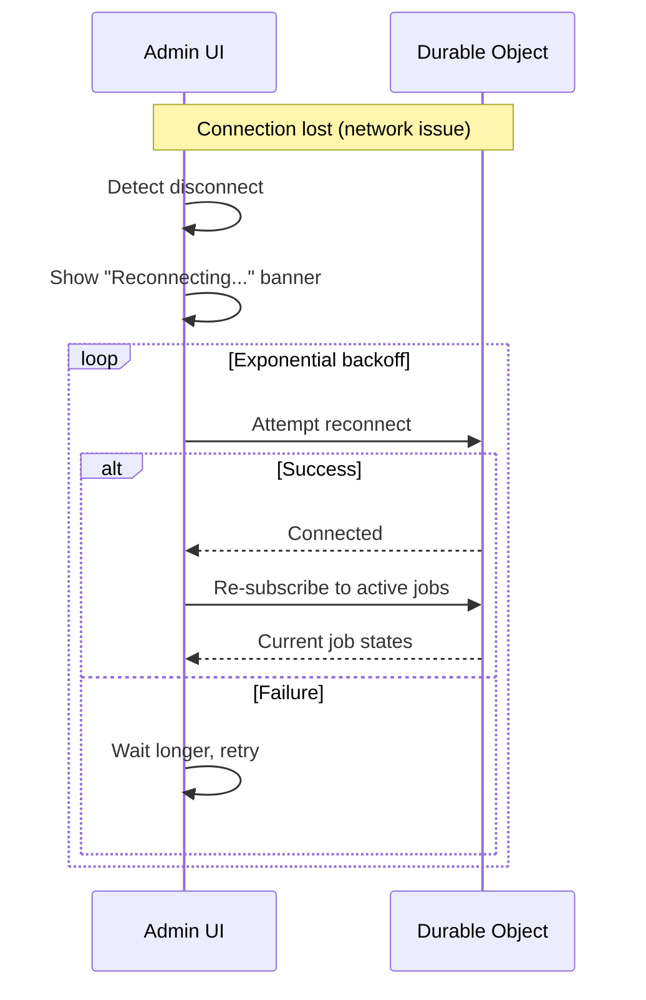

### Scenario 2: Webhook Never Arrives

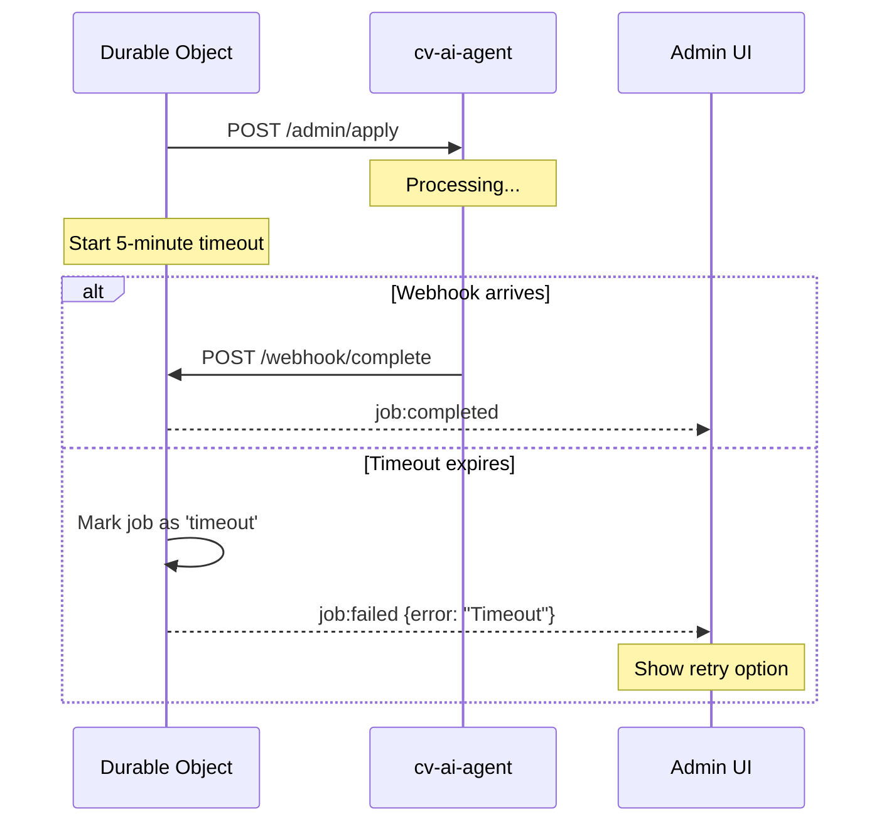

### Scenario 3: Target Service Returns Error

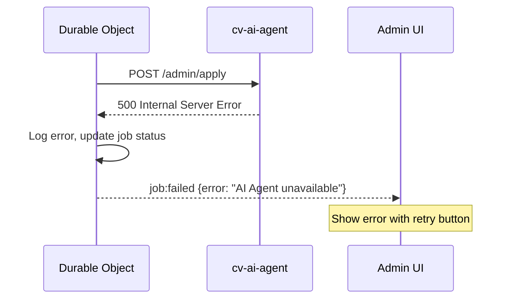

---

## Infrastructure Summary

| Component | Cloudflare Product | Purpose |
|-----------|-------------------|---------|
| Admin UI | **Pages** | React app hosting |
| API Layer | **Workers** (cv-admin-worker) | REST endpoints |
| Real-Time Hub | **Durable Objects** | WebSocket + webhook handling |
| Job State | **KV** | Persist job status |
| Staging Data | **D1** | Staged changes storage |
| Target: D1CV | **Workers** (d1-cv-private) | Portfolio database |
| Target: AI Agent | **Workers** (cv-ai-agent) | Vectorize + AI D1 |

---

## Comparison: Polling vs This Approach

| Aspect | Polling | WebSocket + Webhook |
|--------|---------|---------------------|
| **Latency** | 1-5 seconds (poll interval) | Instant (<100ms) |
| **Requests** | N requests until complete | 1 request + 1 push |
| **Server Load** | High (repeated queries) | Low (event-driven) |
| **UI Experience** | Spinner + "Checking..." | Real-time progress |
| **Timeout Handling** | Complex (poll count limits) | Built-in (DO timeout) |
| **Cost** | Higher (more Worker invocations) | Lower |

---

## Implementation Phases

### Phase 1: Durable Object Setup
- [ ] Create `JobOrchestrator` Durable Object
- [ ] Implement WebSocket handling
- [ ] Add `/notify` endpoint
- [ ] Add `/webhook/*` endpoints

### Phase 2: cv-admin-worker Integration
- [ ] Modify `POST /apply/ai` to notify DO
- [ ] Modify `POST /apply/d1cv` to notify DO
- [ ] Add job creation in D1 staging

### Phase 3: Target Service Updates
- [ ] Add `/admin/apply` to cv-ai-agent
- [ ] Add webhook callback logic
- [ ] Implement HMAC signing

### Phase 4: Admin UI Updates
- [ ] Create `useJobWebSocket` hook
- [ ] Handle connection lifecycle
- [ ] Display real-time job progress
- [ ] Auto-reconnect on disconnect

### Phase 5: Testing & Monitoring
- [ ] End-to-end flow testing
- [ ] Failure scenario testing
- [ ] Add observability (logs, metrics)

---

## Next Steps

1. **Decide**: Proceed with this architecture?
2. **Scaffold**: Create Durable Object in cv-admin-worker
3. **Implement**: WebSocket handling + webhook endpoints
4. **Integrate**: Connect Admin UI via React hook

---

## Staging & Commit Model

### Design Decisions

| Decision | Choice | Rationale |
|----------|--------|-----------|
| **Soft deletes in D1CV** | ✅ Yes (`deleted_at` column) | Recoverability for portfolio data |
| **Soft deletes in AI Agent** | ❌ No (hard delete) | Vectorize doesn't support soft delete |
| **Soft deletes in Staging** | ❌ No (hard delete or status change) | Temporary data |
| **Batch commits** | ✅ Yes (git-like) | Group related changes together |
| **Rollback support** | ❌ No | Keep architecture simple |

---

### Staging Table Schema

```sql
-- cv-admin-worker D1 database

-- Commits (like git commits)
CREATE TABLE commits (
  id TEXT PRIMARY KEY DEFAULT (lower(hex(randomblob(16)))),
  message TEXT,                   -- "Added Rust skills, updated Python"
  status TEXT DEFAULT 'pending',  -- 'pending' | 'applied_d1cv' | 'applied_ai' | 'applied_all' | 'failed'
  
  -- Audit
  created_by TEXT NOT NULL,       -- User email from CF Access
  created_at TEXT DEFAULT (datetime('now')),
  
  -- Apply tracking
  applied_d1cv_at TEXT,
  applied_ai_at TEXT,
  applied_by TEXT,
  
  -- Error tracking
  error_target TEXT,              -- 'd1cv' | 'ai-agent'
  error_message TEXT
);

-- Staged changes (like git staged files)
CREATE TABLE staged_changes (
  id TEXT PRIMARY KEY DEFAULT (lower(hex(randomblob(16)))),
  commit_id TEXT NOT NULL REFERENCES commits(id) ON DELETE CASCADE,
  
  -- What operation
  target TEXT NOT NULL,           -- 'd1cv' | 'ai-agent' | 'both'
  entity_type TEXT NOT NULL,      -- 'technology' | 'project' | 'experience' | 'education' | etc.
  action TEXT NOT NULL,           -- 'CREATE' | 'UPDATE' | 'DELETE'
  
  -- The data
  entity_id TEXT,                 -- NULL for CREATE, existing ID for UPDATE/DELETE
  payload JSON,                   -- Full entity data for CREATE/UPDATE
  
  -- For display
  summary TEXT,                   -- "Python: 5→8 years experience"
  
  -- Timestamps
  created_at TEXT DEFAULT (datetime('now'))
);

CREATE INDEX idx_staged_commit ON staged_changes(commit_id);
CREATE INDEX idx_commits_status ON commits(status);
```

---

### D1CV Soft Delete Schema

Add to existing D1CV tables:

```sql
-- Add soft delete columns to D1CV tables

ALTER TABLE technology ADD COLUMN deleted_at TEXT;
ALTER TABLE technology ADD COLUMN deleted_by TEXT;

ALTER TABLE projects ADD COLUMN deleted_at TEXT;
ALTER TABLE projects ADD COLUMN deleted_by TEXT;

ALTER TABLE experience ADD COLUMN deleted_at TEXT;
ALTER TABLE experience ADD COLUMN deleted_by TEXT;

ALTER TABLE education ADD COLUMN deleted_at TEXT;
ALTER TABLE education ADD COLUMN deleted_by TEXT;

-- Create indexes for efficient filtering
CREATE INDEX idx_technology_deleted ON technology(deleted_at);
CREATE INDEX idx_projects_deleted ON projects(deleted_at);
CREATE INDEX idx_experience_deleted ON experience(deleted_at);
CREATE INDEX idx_education_deleted ON education(deleted_at);
```

**Query pattern for active records:**

```sql
SELECT * FROM technology WHERE deleted_at IS NULL;
```

**Soft delete operation:**

```sql
UPDATE technology 
SET deleted_at = datetime('now'), deleted_by = ?
WHERE id = ?;
```

---

### Git-like Workflow

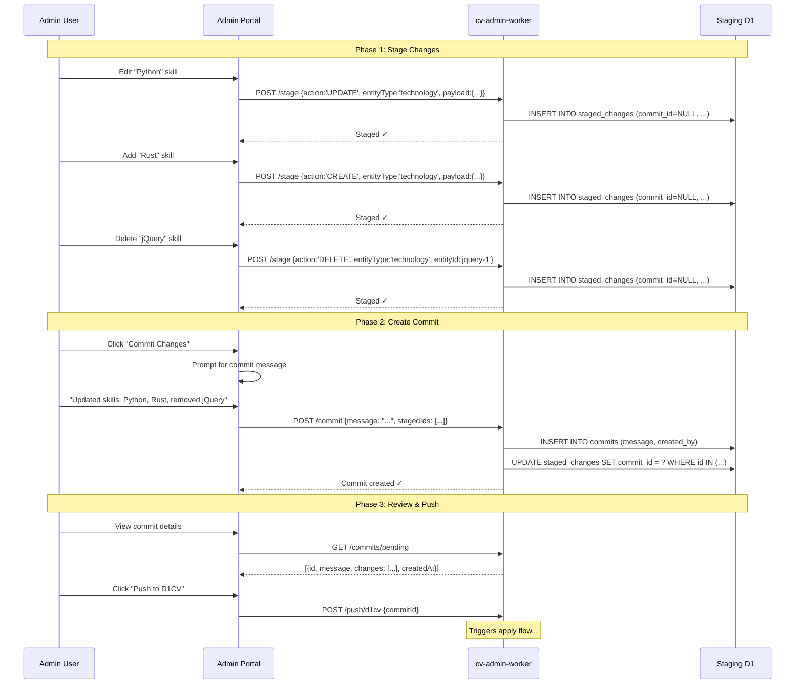

---

### Commit States

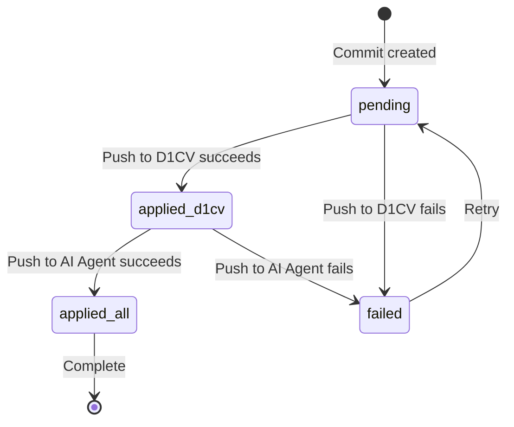

| Status | Meaning |
|--------|---------|
| `pending` | Commit created, not pushed yet |
| `applied_d1cv` | Successfully applied to D1CV, pending AI Agent |
| `applied_ai` | Successfully applied to AI Agent only |
| `applied_all` | Fully synced to both targets |
| `failed` | Push failed (see `error_target`, `error_message`) |

---

### API Endpoints

#### Staging Operations

| Endpoint | Method | Purpose |
|----------|--------|--------|
| `POST /stage` | POST | Stage a single change (uncommitted) |
| `GET /staged` | GET | List uncommitted staged changes |
| `DELETE /staged/:id` | DELETE | Unstage a change |
| `POST /commit` | POST | Create commit from staged changes |
| `GET /commits` | GET | List all commits (with status filter) |
| `GET /commits/:id` | GET | Get commit details with changes |
| `DELETE /commits/:id` | DELETE | Delete pending commit (and its changes) |

#### Push Operations

| Endpoint | Method | Purpose |
|----------|--------|--------|
| `/push/d1cv` | POST | Push commit to D1CV |
| `/push/ai` | POST | Push commit to AI Agent |
| `/push/all` | POST | Push commit to both (D1CV first, then AI) |

---

### Example: Complete Flow

```typescript
// 1. Stage changes (no commit yet)
await api.post('/stage', {
  action: 'UPDATE',
  entityType: 'technology',
  target: 'both',
  entityId: 'python-1',
  payload: { experience_years: 8, proficiency_percent: 40 },
  summary: 'Python: 5→8 years'
});

await api.post('/stage', {
  action: 'CREATE',
  entityType: 'technology',
  target: 'both',
  payload: { name: 'Rust', experience_years: 1, category: 'Backend' },
  summary: 'New: Rust (1 year)'
});

await api.post('/stage', {
  action: 'DELETE',
  entityType: 'technology',
  target: 'both',
  entityId: 'jquery-1',
  summary: 'Remove: jQuery'
});

// 2. Create commit
const { commitId } = await api.post('/commit', {
  message: 'Skill updates: Python experience, add Rust, remove jQuery',
  stagedIds: ['stage-1', 'stage-2', 'stage-3']
});

// 3. Push to targets
await api.post('/push/d1cv', { commitId });
// Wait for webhook confirmation via WebSocket...

await api.post('/push/ai', { commitId });
// Wait for webhook confirmation via WebSocket...
```

---

### UI Components

```text
┌─────────────────────────────────────────────────────────────────┐
│ CV Admin Portal                                    [jose@...] │
├─────────────────────────────────────────────────────────────────┤
│                                                                 │
│  ┌─────────────────────────────────────────────────────────┐   │
│  │ Staged Changes (3)                          [Commit...] │   │
│  ├─────────────────────────────────────────────────────────┤   │
│  │ ● UPDATE  Python: 5→8 years                      [✕]    │   │
│  │ ● CREATE  New: Rust (1 year)                     [✕]    │   │
│  │ ● DELETE  Remove: jQuery                         [✕]    │   │
│  └─────────────────────────────────────────────────────────┘   │
│                                                                 │
│  ┌─────────────────────────────────────────────────────────┐   │
│  │ Pending Commits                                          │   │
│  ├─────────────────────────────────────────────────────────┤   │
│  │ 📦 "Skill updates: Python, Rust, jQuery"                │   │
│  │    3 changes • Created 5 min ago                        │   │
│  │    [Push to D1CV] [Push to AI] [Push All]              │   │
│  └─────────────────────────────────────────────────────────┘   │
│                                                                 │
│  ┌─────────────────────────────────────────────────────────┐   │
│  │ Recent Activity                                          │   │
│  ├─────────────────────────────────────────────────────────┤   │
│  │ ✓ "Add GCP skills" → applied_all (2 hours ago)         │   │
│  │ ✓ "Update experience" → applied_all (yesterday)        │   │
│  └─────────────────────────────────────────────────────────┘   │
│                                                                 │
└─────────────────────────────────────────────────────────────────┘
```text

---

### cv-skills-ops → TypeScript Translation

The PowerShell scripts will become Worker endpoints in `cv-ai-agent`:

| PowerShell Script | TypeScript Endpoint | Purpose |
|-------------------|---------------------|---------|
| `add-technology.ps1` | `POST /admin/apply` | Bulk CRUD operations |
| `reindex.ps1` | `POST /admin/reindex` | Regenerate all embeddings |
| `verify-sync.ps1` | `GET /admin/verify` | Check D1 ↔ Vectorize sync |

#### /admin/apply Implementation

```typescript
// cv-ai-agent/src/routes/admin.ts

interface ApplyPayload {
  jobId: string;
  callbackUrl: string;
  operations: {
    inserts: TechnologyInput[];
    updates: { id: string; changes: Partial<Technology> }[];
    deletes: string[];
  };
}

export async function handleAdminApply(request: Request, env: Env): Promise<Response> {
  const payload: ApplyPayload = await request.json();
  
  try {
    // 1. Process INSERTs
    for (const tech of payload.operations.inserts) {
      await env.DB.prepare(`
        INSERT INTO technology (stable_id, name, category, experience_years, ...)
        VALUES (?, ?, ?, ?, ...)
      `).bind(tech.stableId, tech.name, tech.category, tech.experienceYears, ...).run();
    }
    
    // 2. Process UPDATEs
    for (const { id, changes } of payload.operations.updates) {
      const setClauses = Object.keys(changes).map(k => `${k} = ?`).join(', ');
      await env.DB.prepare(`UPDATE technology SET ${setClauses} WHERE stable_id = ?`)
        .bind(...Object.values(changes), id).run();
    }
    
    // 3. Process DELETEs (hard delete - Vectorize can't soft delete)
    for (const id of payload.operations.deletes) {
      await env.DB.prepare('DELETE FROM technology WHERE stable_id = ?').bind(id).run();
      await env.VECTORIZE.deleteByIds([id]);
    }
    
    // 4. Regenerate embeddings for inserts/updates
    const affectedIds = [
      ...payload.operations.inserts.map(t => t.stableId),
      ...payload.operations.updates.map(u => u.id)
    ];
    
    for (const id of affectedIds) {
      const tech = await env.DB.prepare('SELECT * FROM technology WHERE stable_id = ?')
        .bind(id).first();
      
      if (tech) {
        const text = buildSemanticText(tech);
        const embedding = await env.AI.run('@cf/baai/bge-base-en-v1.5', { text: [text] });
        
        await env.VECTORIZE.upsert([{
          id: tech.stable_id,
          values: embedding.data[0],
          metadata: { name: tech.name, category: tech.category }
        }]);
      }
    }
    
    // 5. Verify sync
    const d1Count = await env.DB.prepare('SELECT COUNT(*) as count FROM technology').first();
    const vectorInfo = await env.VECTORIZE.describe();
    
    // 6. Call webhook with result
    await fetch(payload.callbackUrl, {
      method: 'POST',
      headers: {
        'Content-Type': 'application/json',
        'X-Webhook-Signature': signPayload(env.WEBHOOK_SECRET, payload.jobId)
      },
      body: JSON.stringify({
        jobId: payload.jobId,
        status: 'completed',
        result: {
          inserted: payload.operations.inserts.length,
          updated: payload.operations.updates.length,
          deleted: payload.operations.deletes.length,
          d1Count: d1Count.count,
          vectorCount: vectorInfo.vectorCount,
          synced: d1Count.count === vectorInfo.vectorCount
        }
      })
    });
    
    return new Response(JSON.stringify({ accepted: true }), { status: 202 });
    
  } catch (error) {
    // Call webhook with error
    await fetch(payload.callbackUrl, {
      method: 'POST',
      headers: {
        'Content-Type': 'application/json',
        'X-Webhook-Signature': signPayload(env.WEBHOOK_SECRET, payload.jobId)
      },
      body: JSON.stringify({
        jobId: payload.jobId,
        status: 'failed',
        error: error.message
      })
    });
    
    return new Response(JSON.stringify({ error: error.message }), { status: 500 });
  }
}
```

---

## Implementation Phases (Updated)

### Phase 1: Staging Infrastructure ✅ COMPLETED

- [x] Create `commits` table in cv-admin-worker D1
- [x] Create `staged_changes` table in cv-admin-worker D1
- [x] Create `jobs` table for async operation tracking
- [x] Implement staging endpoints (`/v2/stage`, `/v2/commit`, `/v2/staged`)
- [x] Add soft delete columns to D1CV tables (migration 016)

**Files Changed:**
- `cv-admin-worker-private/migrations/002_commits_and_staging.sql`
- `cv-admin-worker-private/src/types.ts` - Added Commit, StagedChange, Job types
- `cv-admin-worker-private/src/schemas.ts` - Added validation schemas
- `cv-admin-worker-private/src/repository.ts` - Added CommitRepository
- `d1-cv-private/db/migrations/016_add_soft_delete_columns.sql`

### Phase 2: Durable Object Setup ✅ COMPLETED

- [x] Create `JobOrchestrator` Durable Object class
- [x] Implement WebSocket handling for real-time updates
- [x] Add `/job/create`, `/job/status`, `/webhook` endpoints
- [x] Configure wrangler.toml with DO binding

**Files Changed:**
- `cv-admin-worker-private/src/durable-objects/JobOrchestrator.ts`
- `cv-admin-worker-private/wrangler.toml`

### Phase 3: Push Endpoints ✅ COMPLETED

- [x] Implement `POST /v2/push/d1cv` with DO integration
- [x] Implement `POST /v2/push/ai` with webhook callback
- [x] Add WebSocket endpoint `/v2/ws`
- [x] Add webhook receiver `/v2/webhook`

**Files Changed:**
- `cv-admin-worker-private/src/index.ts` - Updated push endpoints + DO routes

### Phase 4: Target Service Updates ✅ COMPLETED

- [x] Add `POST /api/admin/apply` to cv-ai-agent
- [x] Implement D1 insert/update/delete operations
- [x] Implement Vectorize upsert/delete for semantic search
- [x] Add webhook callback to admin worker

**Files Changed:**
- `cv-ai-agent-private/src/handlers/adminHandler.ts` - New admin apply handler
- `cv-ai-agent-private/src/config.ts` - Added ADMIN_APPLY endpoint
- `cv-ai-agent-private/src/index.ts` - Added route for admin apply

### Phase 5: Admin UI ✅ COMPLETED

- [x] Create `useJobWebSocket` hook for real-time updates
- [x] Create `useCommits` hooks for git-like workflow
- [x] Create `CommitsPage` component with staging area
- [x] Add push buttons with progress indicators
- [x] Export new hooks and components

**Files Changed:**
- `cv-admin-portal-private/src/hooks/useJobWebSocket.ts`
- `cv-admin-portal-private/src/hooks/useCommits.ts`
- `cv-admin-portal-private/src/hooks/index.ts`
- `cv-admin-portal-private/src/pages/CommitsPage.tsx`
- `cv-admin-portal-private/src/pages/index.ts`

### Phase 6: Testing & Documentation ✅ COMPLETED

- [x] Update architecture documentation
- [x] All TypeScript errors resolved
- [ ] End-to-end flow testing (requires deployment)
- [ ] Failure scenario testing
- [ ] Soft delete verification

---

## Quick Start

### 1. Deploy Migrations

```bash
# cv-admin-worker-private
cd cv-admin-worker-private
wrangler d1 migrations apply cv-admin-staging

# d1-cv-private (soft delete)
cd ../d1-cv-private
wrangler d1 migrations apply cv-database
```

### 2. Deploy Workers

```bash
# cv-admin-worker (includes Durable Object)
cd cv-admin-worker-private
wrangler deploy

# cv-ai-agent (includes /api/admin/apply)
cd ../cv-ai-agent-private
wrangler deploy
```

### 3. Set Secrets

```bash
# cv-admin-worker
wrangler secret put D1CV_API_URL
wrangler secret put AI_AGENT_API_URL
wrangler secret put WEBHOOK_SECRET
```

### 4. Test Flow

1. Open Admin Portal
2. Make an edit (triggers stage)
3. Go to Commits page
4. Create commit with message
5. Push to D1CV (should complete quickly)
6. Push to AI Agent (triggers reindex)
7. Watch real-time status updates

---

*Created: November 29, 2025*  
*Updated: November 29, 2025*  
*Status: Implementation Complete - Ready for Deployment Testing*
